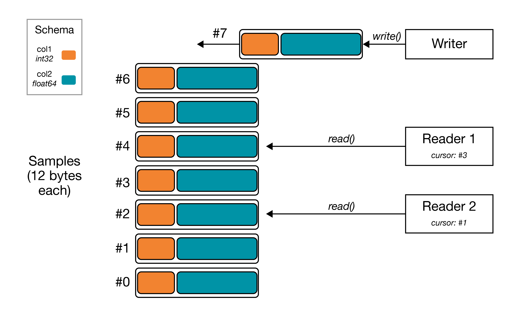

=====
River
=====

*A high-throughput, structured streaming library for C++, Python, and MATLAB*.

River is a C++ framework that affords for *simple*, *schema'd* streaming of data, without any compromises on latency or throughput. River allows for a *writer* to write data to a *stream*, and an unlimited number of *readers* to read data from that *stream* in real-time, with an API similar to that of typical file I/O. Optionally, River supports *ingestion* of all streams to dump streams to disk for retrospective analysis and to support indefinitely long streams.

Under the hood, River utilizes `Redis <https://redis.io>`_, an industry-standard in-memory database, which allows for low latency, high throughput, and simplified architecture.

Written in C++, with bindings in Python and (experimental) bindings in MATLAB.

|

   Example schematic of a stream with two fields, a 32-bit int `col1` and 64-bit double `col2`, with a writer and two readers. Readers each have their own independent cursor to consume data from the stream, while the writer appends to the end of the stream.

|

Getting Started
---------------
Eager to get started? Check out the :doc:`installation <install>` and :doc:`tutorial <tutorial>`. Otherwise, read on for some motivation about River.

Premise
-------

Research and Internet-of-Things (IoT) applications often need to pipe data between devices in near-realtime -- a temperature sensor relays data to a microcontroller that controls a thermostat. While a home-grown solution can likely work for simple systems, more complex systems will inevitably require data produced by a single device to be read by multiple sources, often simultaneously -- that temperature sensor might need to also relay its data to a computer for a realtime display. These requirements intensify with the growing data capabilities of our hardware. Crafting a multi-reader system like this from scratch quickly becomes an untenable effort.

Enter streaming frameworks: libraries designed to "produce" data to many "consumers". There are many robust and industry-standard streaming frameworks out there such as `RabbitMQ <https://www.rabbitmq.com/>`_, `Kafka <https://kafka.apache.org/>`_, and `ZeroMQ <https://zeromq.org/>`_; however, they can be cumbersome to install & manage for non-enterprise environments (e.g. Kafka), have limited single-stream throughput (e.g., RabbitMQ's `~50k messages/sec <https://www.cloudamqp.com/blog/2018-01-08-part2-rabbitmq-best-practice-for-high-performance.html>`_ max even with persistence disabled), or require non-trivial application-level code to be usable for multi-reader streaming (e.g., ZeroMQ). These frameworks are tailored towards stricter requirements than is often required for our settings here, where perhaps some trailing data can be dropped and/or delivered twice in failure cases.

**River** was created to meet the needs of streaming in a research or IoT world: stream data from one device to many others, prioritizing minimal setup and high performance over strict guarantees on message delivery and persistence*. River is built on the high-throughput `Redis Streams <https://redis.io/topics/streams-intro>`_, released in Redis 5.0, and then layers a schema and metadata to make it easy to stream.

However, streaming is often only the _first_ part of the story. Researchers and makers often want to see what was streamed after-the-fact - to analyze that data offline. River addresses this unmet need with its "data ingestion": persisting data that was streamed via River to disk. Packaged in a separate binary, the `ingester` is a long-running server process that polls for River streams created in Redis and automatically writes the data in batches to disk using a columnar data storage format, [Apache Parquet](https://parquet.apache.org/). Once a segment of data is persisted and considered sufficiently stale, the `ingester` will delete this data from Redis, thus affording for indefinitely large streams.

* River utilizes Redis for all data storage and thus has the same data consistency guarantees as is configured in your Redis server.*

Welcome to river's documentation!
=================================

.. toctree::
   python
   cpp

Indices and tables
==================

* :ref:`genindex`
* :ref:`modindex`
* :ref:`search`

Python Docs
===========
:doc:`python`

C++ Docs
===========
:doc:`cpp`
