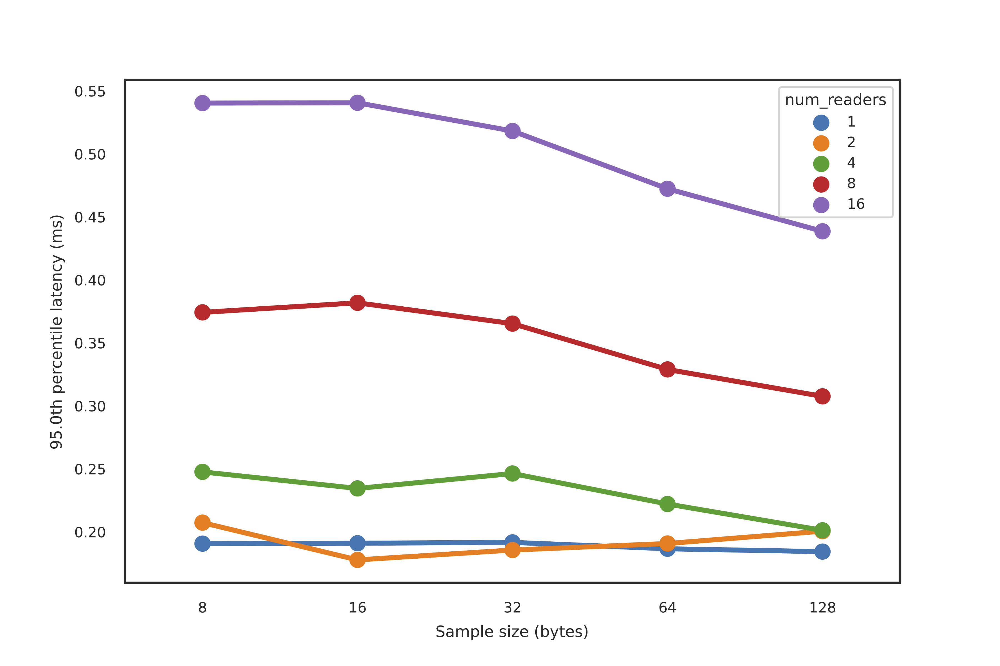
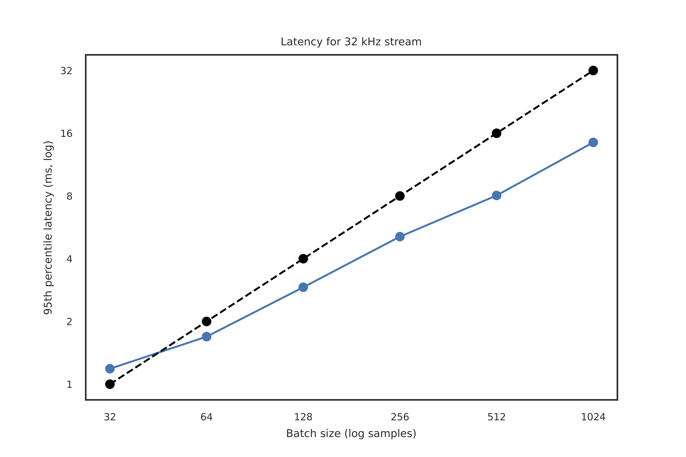
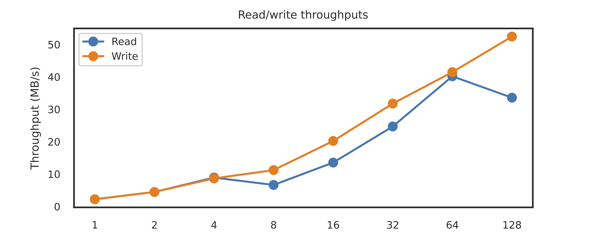

===========
Performance
===========

There are a few ways to measure performance of a streaming framework, with different metrics useful to different use cases.

For use cases involving small but time-sensitive events that needed to be communicated across devices, the raw latency of the system is important. On the other hand, for use cases in which there is a large volume of data being produced on a regular basis (e.g. from a data acquisition device), then a more relevant metric may be the throughput at which reading/writing to the stream no longer keeps up with the production of data.

For the below tests, we streamed samples across a network with simultaneous readers and writers to simulate various real-world scenarios. The size, volume, and number of simultaneous readers were varied.

Latency
-------

To test latency, we streamed events in the form of a single sample every 1ms (i.e. at 1 kHz) and measured the time between immediately before the sample was written to the time immediately after the corresponding sample was read from the stream. When there was more than 1 reader, the maximum latency across all latencies for each sample was taken.

95th percentile latencies for events were well under a millisecond, even with a larger number of readers (16) and larger sample sizes (128 bytes). Note that Redis 5 was used in these tests; Redis 6.0+ introduced multi-threaded I/O and could lead to increased performance, especially when handling concurrent reads.

|

   95th percentile latencies from writing to reading of a single sample every 1ms, when the number of simultaneous readers (colors) and the size of a single sample (x-axis) were varied.

|

Throughput
----------
To test throughput, we considered a stream of data to be written then read of some fixed generating sampling rate. In particular, we considered a stream generated at 32 kHz, with each sample being 768 bytes (i.e. fairly large but believable for the neuroscience community). This equates to a throughput of 23.4 MB/s.

We then can write/read this data in various batch sizes, i.e. chunks of data at a time. Due to non-trivial overhead from network calls and Redis protocol, for very small batch sizes there will be non-negligible overhead for each write/read and thus could lead to writing outpacing reading of the stream. Larger batch sizes should handle higher-throughput data streams, with a tradeoff in latency.

The below shows the results of the 95th percentile latencies for simultaneous writing and reading of this 23.4 MB/s data stream. The black dotted line indicates the (putative) threshold at which the writing of the stream may begin to outpace the reading, i.e. when the latency of the reader is larger than the period at which the batches are written.

The takeaway is that for batch sizes of 64 samples and above, equating to at least a 2ms buffer for this 32 kHz stream, our reading can keep up with the production of the data.

|

   95th percentile latencies as a function of sample size when writing a 23.4 MB/s stream of data. Black dotted line indicates the threshold of latency at which the reading of the stream may begin to fall behind the production of the data.

|

Max throughput
--------------
The above tests for throughput test a realistic case of having simultaneous readers and writers. However, another useful performance test could be a test of the maximum write and read throughput with no other activity within River ongoing. To test this, we fixed the amount of samples and data to be written, and measured total time to write and then read that data in its entirety. Again, batch size -- i.e., the number of samples written at a time -- will affect performance, and so batch size was varied.

Read and write throughputs exceeeded 30 MB/s when appropriate batch sizes were used. It is highly likely the performance-limiting factors are network speeds and memory bandwidth speeds, not necessarily CPU.

|

   Total time taken to read (blue) and write (orange) 31.25MB of data, where reading and writing took place sequentially with varying batch sizes.

|

Implementation details
----------------------
The above tests were run with Redis server version 5.0.6 running on Ubuntu 18.04, on a Dell Precision 5820 Tower running an Intel Xeon W-2135 CPU @ 3.70GHz. The reading/writing was run on a separate computer on the same local network running an Intel Xeon E3-1200 v5/E3-1500. Both used the built-in 1-Gigabit network cards, and were networked via the MikroTik hEX S Gigabit Ethernet Router (RB760iGS). Python code for testing performance can be found in performance/performance.py.

